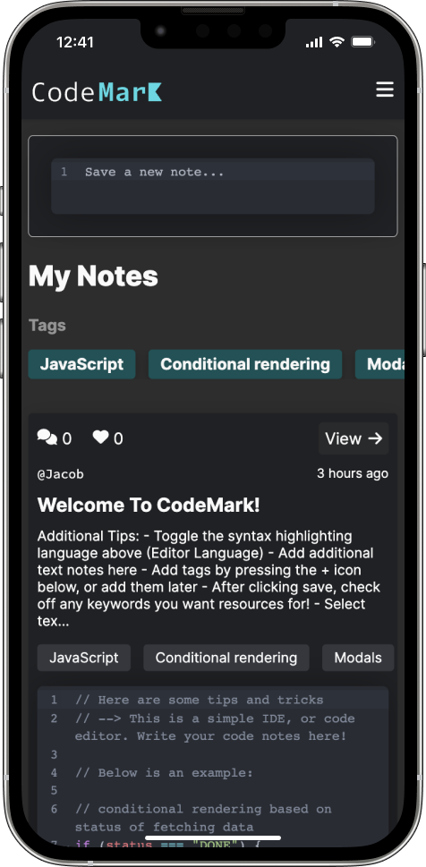
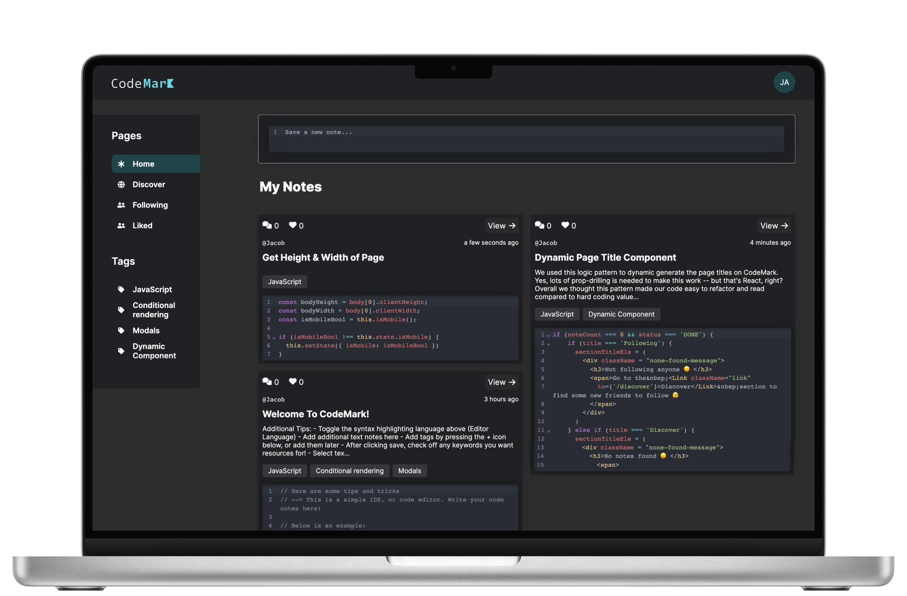
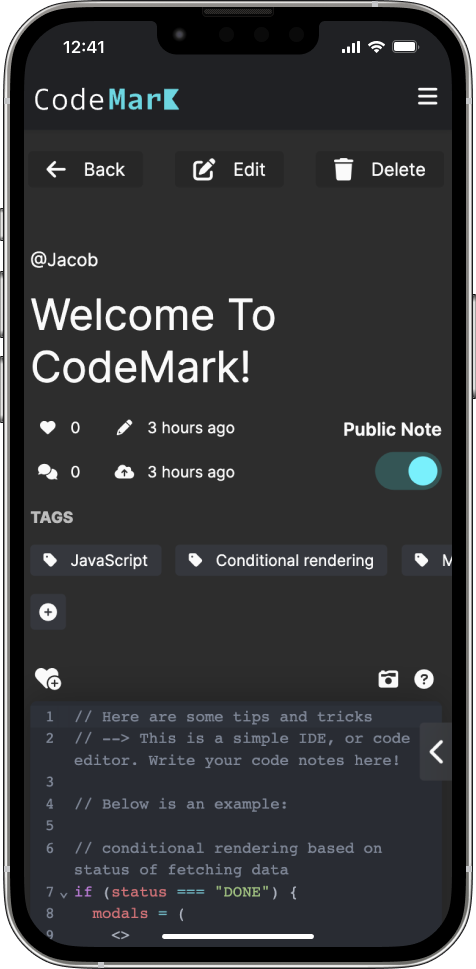
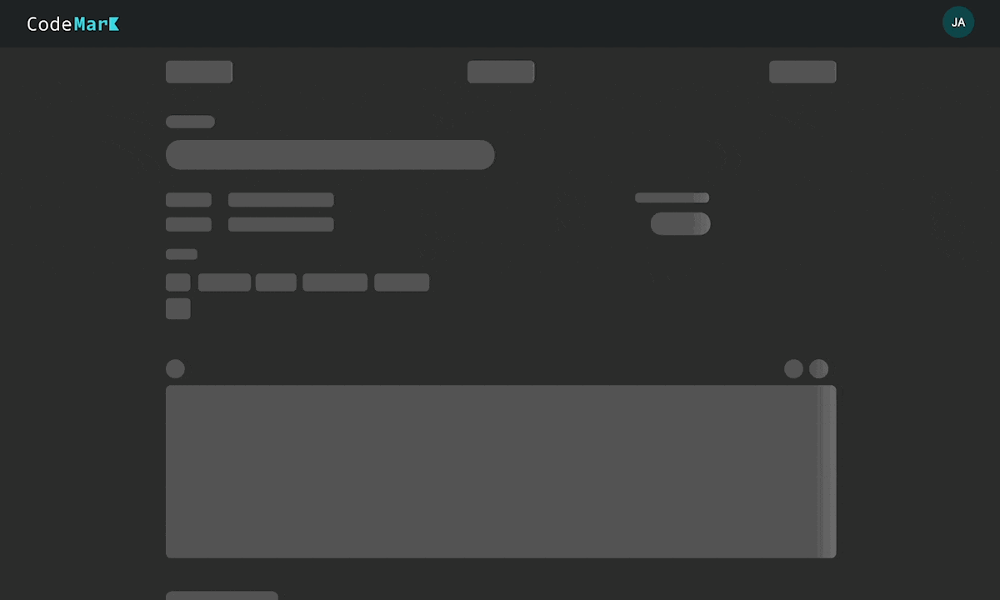
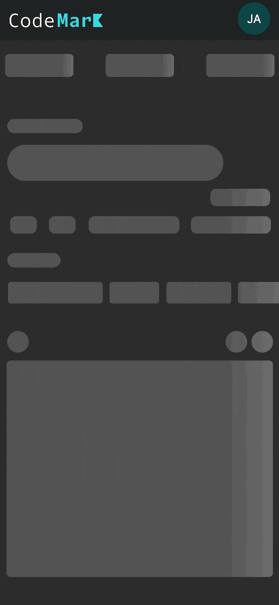
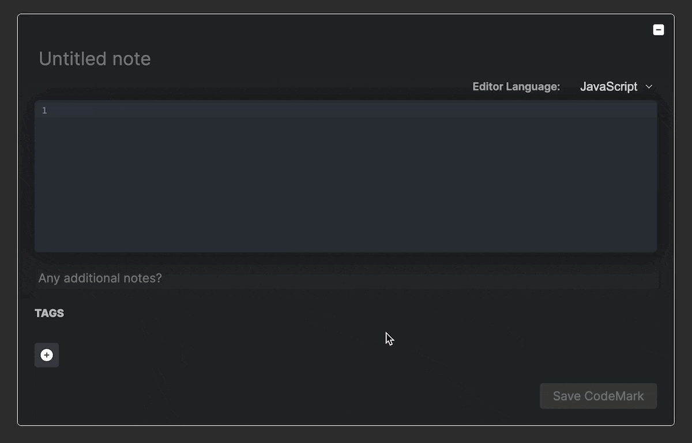
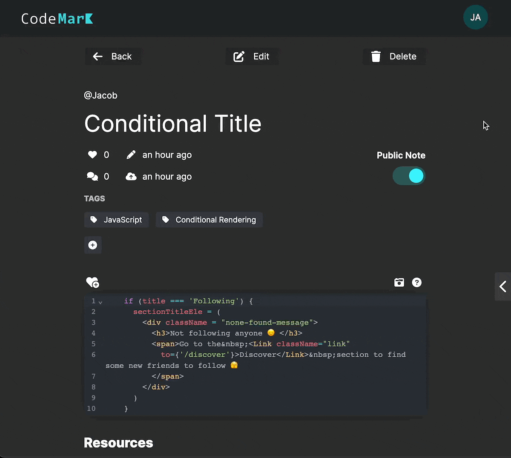

# CodeMark


<br>

**Live link: [CodeMark](https://code-mark.herokuapp.com/)**

<br>

### Table of Cotents
- [CodeMark](#codemark)
    - [Table of Cotents](#table-of-cotents)
  - [Summary](#summary)
  - [Technologies Used](#technologies-used)
    - [MERN Stack](#mern-stack)
    - [Additional Technologies](#additional-technologies)
  - [Key Features](#key-features)
    - [Creating & Editing CodeMarks](#creating--editing-codemarks)
    - [Content Placeholders](#content-placeholders)
    - [Frontend Form Validations](#frontend-form-validations)
    - [Export Image of CodeMark](#export-image-of-codemark)
    - [Highlight Code to Comment](#highlight-code-to-comment)
    - [Global Modal - Success and Error Messages](#global-modal---success-and-error-messages)
    - [Custom Backend Routes](#custom-backend-routes)
  - [Code Snippets](#code-snippets)
    - [Conditional Rendering](#conditional-rendering)
    - [Multi-Step Modals](#multi-step-modals)
    - [Resources](#resources)

<br>

<table>
<td>
  
</td>
<td>
  
</td>
<td>
  
</td>
</table>


## Summary
CodeMark is a tool built for developers that allows you to save, view, and share code snippets (i.e. methods, functions, algorithms, etc.) Based on the code provided, CodeMark will extract the keywords and provide you a list of options to receive resources for. These resources are saved with your note and can be referenced anytime, or edited along with the note in the future. Feeling lonely? Gain insights from other users in the discover section, where you can view, like, and comment on other user’s public notes. 

Don’t want to share your code? No problem, just toggle your note to private. To keep things organized and easy to find tags can be added to notes, allowing you to filter any page by tag. Extra attention was put into making the CodeMark experience feel native for developers mainly by integrating an IDE with proper syntax highlighting, autocomplete, and a sweet dark theme.


<br>

## Technologies Used

### MERN Stack
- **MongoDB** - NoSQL document-oriented database
- **Mongoose** - Object data modeling (ODM) library for MongoDB and Node.js
- **Express.js** - Back-end web application framework, define our database API
- **React & Redux** - Frontend library with global state management
  - **Axios** - Promise based HTTP client to connect the browser our Node environment
  - **Thunk** - Middleware providing async database queries via dispatch
- **Node.js** - Backend runtime environment


### Additional Technologies

- **CodeMirror 6** via **react-codemirror** - Customizable IDE for code input, editing, and viewing on the web.

- **Custom Google Search JSON API** - Based on the keywords and language detected for a given note, we search for resources and immediately serve them back to the user.

- **dom-to-image** - Used to convert a DOM element into a .png image directly on the browser. Implemented to allow users to export images of any public note on CodeMark. 

- **file-saver** - Provides the ability to save a file (image generated of a CodeMark) on the user’s local device storage.

- **Highlight.js**  - Leveraged the language detection feature of Highlight.js by providing a code snippet and an array of possible languages. Highlight.js suggestions are more accurate than CodeMirror, and we never use the syntax highlighting features provided by Highlight.js. Instead, we take the language suggestion and combine it with keywords to search for resources more accurately via the Google Search API.

<br>

## Key Features

### Creating & Editing CodeMarks
**Challenge**

- Multi-step form for creating and editing notes: 
  - First users must create the CodeMark with a code snippet, need to detect and save the language of the note in real time
  - Then we need to extract keywords from the note
  - Finally, we need to provide the keywords to the user so they can which the keywords they actually want resources for
- Accurately scraping the web for relevant resources, without getting blocked as a bot or returning nothing

**Solution**
- Created frontend form validations to ensure we had a code snippet to extract keywords from
Limited each note to a maximum of 5 keywords to reduce our Google Search API calls 
- Explored 3 options to scrape the web, decided on the most reliable solution of the Custom Google Search API and configured it to search Google itself (usually used to search one’s own site)
- Combined the keyword with the detected language of the note to increase accuracy of results


<br>

### Content Placeholders
**Challenge**
- Determining when and when not to show placeholders
- Retaining the structure of the page between loading and ready states
- Responsively resising content loaders for all window sizes

**Solution**
- Add loading states to thunk action creators, check loading state in components to conditionally render components based on status of data
- Maintain the same outer ```div``` elements and ```classes```
- Implement svg content loaders utilizing create-react-content-loader to form skeletons

Live demo of the repsonsive content loaders in action: https://code-mark.herokuapp.com/#/dev/note/lazy-load

<table>
  <td>
    
  </td>
  <td>
    
  </td>
</table>

<br>

### Frontend Form Validations
**Challenge**
- Submitting the signup form, note form, or comment form with invalid inputs caused server errors, and sometimes led to incomplete database entries that led to further errors on the frontend
**Solution**
- Prevent users from submitting forms with invalid inputs by disabling submit buttons 
To improve the UX, we provide a message on hover that clearly states why the submit button is disabled to there is no confusion or frustration



<br>

### Export Image of CodeMark
**Challenge**
- For users who want to share their note on another platform the only option would be to take a screenshot and manually edit the photo, since our site utilizes protected routes limiting it to only registered and signed in users
  
**Solution**
- All a user needs to do is press the export image icon to save an image of their CodeMark locally
The image is generated from a modal designed to reduce the content visible to the most important information
- The image is saved as an .png and is exported at 2x the actual viewport resolution to ensure a legible export without artifacts



<br>

### Highlight Code to Comment

**Challenge**
- Sometimes we want to comment directly on a specific line or section of the code note, but we don’t want to rewrite it or copy/paste on our own

**Solution**
- To save users’ time and energy, we implemented a modal that only shows up when text is selected, providing an easy interface for commenting on the highlighted code


<br>

### Global Modal - Success and Error Messages
Challenge
- Based on user actions, deliver success or error messages
- Handle different types of errors (custom messages and server messages)

Solution
- Global modal is subscribed to errors slice of state
- When a message is received, we check the format of the data, if it is an object we extract the message
- Custom messages are provided as an array in the format of: ```['error', 'Custom message']```


<br>

### Custom Backend Routes

**Challenge**
- Certain CRUD operations do not always follow the standard RESTful routes such as adding/removing a like or adding/removing a tag on a note
- No need to update all information on the note (collecting all data for the note, sending to backend, then receiving the entire updated note on the frontend)
- When deleting an object with many references, all the referenced objects need to be deleted as well (deleting a user should also delete all of their comments, likes, and notes)

**Solution**
- Custom backend routes that carry out various CRUD functionality for user, note and comment clusters in mongoDB database
- Returns object data and errors in JSON format for frontend usage
- Branches out to update other documents based on ObjectId references


## Code Snippets
**Create User Route**
```javascript
router.post('/register', (req, res) => {
  const { errors, isValid } = validateRegisterInput(req.body);

  if (!isValid) {
    return res.status(400).json(errors);
  }
  User.findOne({ email: req.body.email }) //check email availability
    .then(user => {
      if (user) {
        return res.status(400).json({ email: "A user has already registered with this address" })
      } else {
        User.findOne({ username: req.body.username }) //check username availability
          .then(user => {
            if (user) {
              return res.status(400).json({ username: "A user has already registered with this name" })
            } else {
              const newUser = new User({
                username: req.body.username,
                email: req.body.email,
                password: req.body.password,
                color: req.body.color
              })
                        //hash password
              bcrypt.genSalt(10, (err, salt) => {
                bcrypt.hash(newUser.password, salt, (err, hash) => {
                  if (err) throw err;
                  newUser.password = hash;
                  newUser.save()
                    .then(user => {
                      res.json([user,['success', 'User Successfully Registered!']])
                      Note.findById('629e5961cb981eeef9b649a0') //create default note
                        .then(note => {
                          const newNote = new Note({
                            user: { username: user.username, userId: user.id },
                            codebody: note.codebody,
                            title: note.title,
                            textdetails: note.textdetails,
                            comments: note.comments,
                            resources: note.resources,
                            tags: note.tags,
                            likes: note.likes,
                            language: note.language,
                            public: false,
                            sample: true
                          })
                          newNote.save()
                            .then(note => {
                              user.notes.push(note.id);
                              user.save();
                            })
                        })
                        .catch(err => res.json({user: err}))
                    })
                    .catch(err => res.json({user: err}))
                })
              })
            }
          }
          )
      }
    })
}
)
```

**Get Note Route**
```javascript
//get one note by id
router.get('/:id', (req, res) => {
    Note.findById(req.params.id)
        .then(note => res.json(note))
        .catch(err =>
            res.status(404).json({ nonotefound: 'No Note Found With That ID' })
        );
});
```

**Update Note Route**
```javascript
//edit a note if the current user made it
router.patch('/:id/edit',
    passport.authenticate('jwt', { session: false }),
    (req, res) => {
        Note.findById(req.params.id)
            .then(note => {
                if (note.user.userId.toString() !== req.user.id) {
                    res.status(404).json({ editnotallowed: 'Not Authorized To Edit Note' })
                } else {
                    getResources(req.body.keywords, req.body.codebody)
                        .then(resources => {
                            note.codebody = req.body.codebody || note.codebody;
                            note.title = req.body.title || note.title;
                            note.textdetails = req.body.textdetails || note.textdetails;
                            note.likes = req.body.likes || note.likes;
                            note.tags = req.body.tags || note.tags;
                            note.language = req.body.language || note.language;
                            note.resources = resources || note.resources;
                            if (req.body.public != null &&
                                req.body.public !== undefined) {
                                note.public = req.body.public
                            }
                            note.save()
                                .then(note => {
                                    res.json([note,['success', 'Note Successfully Updated!']])
                                })
                        })
                }
            })
            .catch(err =>
                res.status(404).json({ nonotefound: 'No Note Found With That ID' })
            )
    })
```

**Delete User Route**
```javascript
router.delete('/:userId', passport.authenticate('jwt', { session: false }), (req, res) => {
  if (req.params.userId !== req.user.id) {
    res.status(400).json({ deletenotallowed: 'Not Authorized to Delete User' })
  } else {
    User.findById(req.params.userId)
      .then(deleteuser => {
        var noteIds = deleteuser.notes;
        var commentIds = deleteuser.comments;
        var commentLikesIds = deleteuser.comment_likes;
        var noteLikesIds = deleteuser.note_likes;
        var followers = deleteuser.followers;
        var following = deleteuser.following;

        User.deleteOne({ _id: deleteuser.id })
          .then(() => {
            followers.forEach(followerId => { //deleting follower references
              User.findById(followerId)
                .then(user => {
                  user.following = user.following.filter(item => item.toString() !== req.params.userId);
                  user.save();
                })
            })
            following.forEach(followId => { //deleting following references
              User.findById(followId)
                .then(user => {
                  user.followers = user.followers.filter(item => item.toString() !== req.params.userId);
                  user.save();
                })
            })
            commentLikesIds.forEach(commentLikeId => {  //deleting comment likes
              Comment.findById(commentLikeId)
                .then(comment => {
                  comment.likes = comment.likes.filter(item => item.toString() !== req.params.userId);
                  comment.save().then(comment => res.json(comment));
                })
                .catch(err => res.status(404).json({ nocommentfound: "No Comment Found With That ID" }))
            })
            noteLikesIds.forEach(noteLikeId => {  //deleting note likes
              Note.findById(noteLikeId)
                .then(note => {
                  note.likes = note.likes.filter(item => item.toString() !== req.params.userId);
                  note.save().then(note => res.json(note));
                })
                .catch(err => res.status(404).json({ nonotefound: "No Note Found With That ID" }))
            })
            commentIds.forEach(commentid => { //deleting comments
              Comment.findById(commentid)
                .then(comment => {
                  Comment.deleteOne({ _id: commentid })
                })
                .catch(err => res.status(404).json({ nocommentfound: "No Comment Found With That ID" }))
            })
            noteIds.forEach(noteId => { //deleting notes
              Note.findById(noteId)
                .then(note => {
                  const innercommentIds = note.comments;
                  Note.deleteOne({ _id: noteId })
                    .then(() => {
                      innercommentIds.forEach(innercommentid => {
                        Comment.findById({ _id: innercommentid })
                          .then(comment => {
                            Comment.deleteOne({ _id: innercommentid })
                          })
                          .then(comment => {
                            User.findById(comment.user.userId)
                              .then(user => {
                                user.comments = user.comments.filter(item => item.toString() !== innercommentid);
                                user.save().then(user => res.json(user));
                              })
                          })
                          .catch(err => res.status(404).json({ nocommentfound: "No Comment Found With That ID" }))
                      })
                    })
                })
                .catch(err => res.status(404).json(
                  { nonotefound: "No Note Found With That ID" }
                ))
            })
          })
      })
      .then(() => res.json([req.params.userId,['success', 'User Account Successfully Deleted!']])) // was id
      // .then(deleteuser => res.json(deleteuser._id)) // was id
      .catch(err =>
        res.status(404).json({ nouserfound: "No User Found With That ID" })
      );
  }
})
```

### Conditional Rendering
```javascript
// first case: user has no notes 
if ((!props.notes || props.notes?.length === 0)
        && (props.status === 'DONE' || props.status === 'IDLE')) {
        return (
            <div className='desktop-notes'>
                <div className='column1'>
                </div>
                <div className='column2'>
                </div>
            </div>
        )
    // second case: notes are being fetched
    } else if (props.status === 'BUSY') {
        return (
            <div className='desktop-notes'>
                <div className='column1'>
                    <CodeNoteItemLoader />
                    <CodeNoteItemLoader />
                    <CodeNoteItemLoader />
                </div>
                <div className='column2'>
                    <CodeNoteItemLoader />
                    <CodeNoteItemLoader />
                </div>
            </div>
        )
    // third case: notes have been fetched and are in state
    } else if (props.status === 'DONE' ||
        (props.notes.length && props.status === 'IDLE')) {
        return (
            <div className='desktop-notes'>
                    <div className='column1'>
                        {col1.map((note) =>
                            <CodeNoteItem key={note._id}
                                title={note.title}
                                tags={note.tags}
                                likes={note.likes}
                                username={note.user.username}
                                userId={note.user.userId}
                                textDetails={note.textdetails}
                                codeBody={note.codebody}
                                // ...
                            />
                        )}
                    </div>
                    <div className='column2'>
                        {col2.map((note) =>
                            <CodeNoteItem key={note._id}
                                title={note.title}
                                tags={note.tags}
                                likes={note.likes}
                                username={note.user.username}
                                userId={note.user.userId}
                                textDetails={note.textdetails}
                                codeBody={note.codebody}
                                // ...
                            />
                        )}
                    </div>
            </div>
        )
    } 
```

### Multi-Step Modals
```javascript
// toggle primary edit modal to edit a note
  toggleEditModal() {
    const editNoteModal = document.getElementById('note-edit-wrapper');
    const resourcesNoteModal = document.getElementById('resources-step-1');

    if (editNoteModal.className = "edit-note-container modal-on") {
      editNoteModal.className = "edit-note-container modal-out-removed"
    } else {
      editNoteModal.className = "edit-note-container modal-on"
    }

    if (resourcesNoteModal.className === "resources-modal modal-off") {
      // call getKeywords to extract keywords used for getting resources
      const keywords = getKeywords(this.state.codebody);
      this.setState({
        allKeywords: [...new Set(this.state.keywordsSelected.concat(keywords))]
      }, () => {
        // toggle next modal on where user selects their keywords 
        resourcesNoteModal.className = "resources-modal modal-on"
      })
    } else {
      resourcesNoteModal.className = "resources-modal modal-off"
    }
  }

  toggleResourceModal(){
    // resource modal toggled after step one is completed
    const step1 = document.getElementById('resources-step-1');
    step1.className = 'resources-modal modal-off';
    const wrapper = document.getElementById('edit-note-container');
    // reset modals to initial state
    wrapper.className = 'modal-off';
    const noteEdit = document.getElementById('note-edit-wrapper');
    noteEdit.className = 'edit-note-container';
  }
```

### Resources
```javascript
//get search results
const getGoogleAdvice = (search) => {
    const encodedString = encodeURI(search);
    return axios
        .get(`https://www.googleapis.com/customsearch/v1?key=${apiKey}&cx=${engineId}&q=${encodedString}&hl=en&gl=us`, AXIOS_OPTIONS)
        .then(({ data }) => {
            return {
                keyword: search,
                link: data.items[0].link,
                title: data.items[0].title
            }
        })
        .catch(err => {
            console.log(err)
        })
}
```